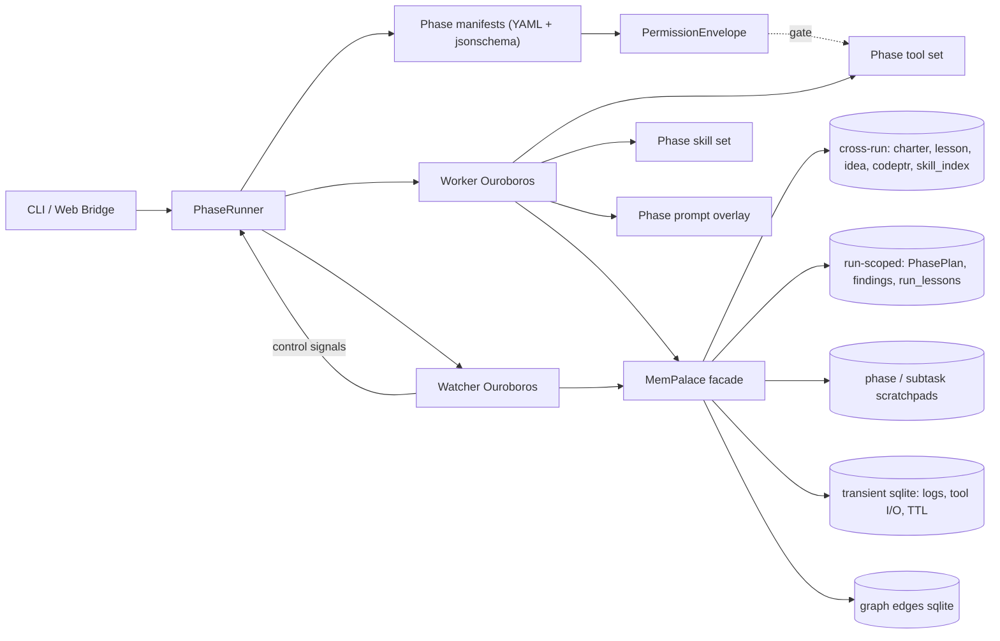
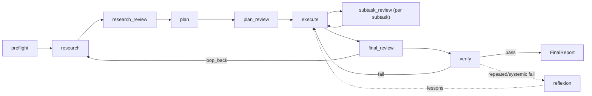

# Umbrella

Umbrella is a **workspace-first, phase-driven control plane** around the multi-agent framework **GMAS**. It orchestrates long-running improvement cycles through a deterministic phase machine, governs tool access via `PermissionEnvelope`, and maintains a unified memory layer (`MemPalace`) across runs.

The system runs two Ouroboros agents in parallel per run: a **Worker** executing the current phase, and a **Watcher** monitoring for stalls, repeated errors, and budget overruns.

**One-sentence summary:** **PhaseRunner orchestrates phases, Worker executes, Watcher guards, MemPalace remembers, workspace delivers.**

Full technical report: [docs/technical-report/README.md](docs/technical-report/README.md).

## Architecture Overview



## Three-Layer Model

| Layer | Directory | Role | Mutability |
|-------|-----------|------|------------|
| Framework | `gmas/` | Multi-agent graph engine, runners, tools, memory | **Read-only** for auto-patches |
| Workspaces | `workspaces/` | Application systems solving concrete tasks | Primary change surface |
| Control plane | `umbrella/` | Phase machine, memory, permissions, retrieval, web bridge | Freely mutable |
| Deep agent | `ouroboros/` | LLM loop, tool registry, phase manifest consumer | Mutable by rules |

## Phase-Driven Run Lifecycle

Every run follows a `PhasePlan` — a sequence of phases, each described by a YAML manifest that defines allowed tools, skills, prompts, memory access, and exit criteria.



Each phase manifest is validated against `umbrella/phases/schema/manifest.schema.json`. The `PhaseRunner` spawns a Worker-Ouroboros per phase with the manifest's tool filter and prompt overlays. The Watcher is a read-only polling supervisor inside the runner wait cycle: it wakes on trigger conditions (stall, repeated error, verify fail, budget overrun), emits repair signals, and lets the next Worker phase perform any workspace edits. Reflexion is an optional repeated-failure/self-improvement path, not the default first verify-failure route.

## Repository Structure

```
umbrella/
  phases/           Phase machine: manifests, loader, registry, schema
  orchestrator/     Runner, Worker, Watcher, PhasePlan, FinalReport
  permissions/      PermissionEnvelope, global.yaml, watcher envelope
  memory/palace/    MemPalace facade: stores, tiers, graph, recall
  prompts/phases/   System + overlay prompts per phase + watcher prompt
  skills/library/   Skill packs with phase-tagged frontmatter
  web_bridge/       HTTP server + JSON API (/api/*) + React static hosting
  retrieval/        BM25 + symbol + docs search over GMAS
  verification/     Workspace verification runner
  workspace_registry/  Discovery and catalog of workspaces
  workspace_runtime/   Instance creation, adapters, snapshot
  integration/      UmbrellaServices locator, Ouroboros launcher/bridge
  control_plane/    Critic, remediation planner, sandbox self-edit
  tests/            Test suite

ouroboros/
  ouroboros/
    loop.py         Main LLM tool loop (~5800 lines)
    agent.py        Thin orchestrator, delegates to loop/tools/llm
    context.py      Context builder: messages, compaction
    tools/          22 tool modules including phase_control, palace_tools
  supervisor/       Telegram, event dispatch, task queue, worker lifecycle

gmas/               Multi-agent framework (read-only)
workspaces/         Application workspaces (seeds + instances)
web/                React operator UI (chat, runs, memory, phases, settings)
```

## Requirements

- **Python** >= 3.11
- **[uv](https://docs.astral.sh/uv/) for dependency management
- **Node.js** + **Yarn** or **npm** (for the Web UI in `web/`)

## Installation

From the repository root:

```powershell
uv sync --extra dev
```

Optional Terminal Bench profile: `uv sync --extra dev --extra tb`.

Verify installation:

```powershell
uv run pytest -q
```

## LLM Configuration (`.env`)

Place a `.env` file in the repository root (loaded by `umbrella.env.load_env`):

| Variable | Required | Description |
|----------|----------|-------------|
| `LLM_API_KEY` | Yes | API key (or `OPENAI_API_KEY`) |
| `LLM_MODEL` | No | Default model for some paths |
| `LLM_BASE_URL` | No | Proxy or non-standard endpoint |
| `OUROBOROS_MODEL` | No | Override model for Ouroboros |
| `OUROBOROS_MAX_ROUNDS` | No | Max LLM rounds per phase (<=0 = unlimited) |

## Running

### Single run via CLI

```powershell
uv run python umbrella/app_ouroboros.py workspaces/<workspace_id> --live --verbose --max-verify-retries 3
```

Key flags: `--task`, `--task-file`, `--timeout-hours`, `--max-budget`, `--max-rounds`, `--mock`, `--no-verify`, `--verification-timeout-seconds`, `--allow-seed-writes`.

### Web Bridge (API + UI)

```powershell
# Build frontend
cd web && yarn install && yarn build && cd ..

# Start bridge (default port 8765)
uv run bridge
```

Then open `http://127.0.0.1:8765`.

Arguments (`umbrella/web_bridge/server.py`): `--host` (default `127.0.0.1`), `--port` (default `8765`), `--repo-root`, `--log-level`.

### Docker deployment

```powershell
docker compose up --build
```

Or build/run directly:

```powershell
docker build -t umbrella:latest .
docker run --rm --env-file .env -p 8765:8765 umbrella:latest
```

For public hosting, deploy the included `Dockerfile`, set runtime secrets such as `LLM_API_KEY` / `OPENAI_API_KEY`, and use `/api/health` as the health check. See [Docker deployment](docs/docker-deploy.md) for volume and platform notes.

### Development mode (hot reload)

Two processes:
1. Bridge API: `uv run bridge`
2. React dev server: `cd web && yarn start` (usually `http://localhost:3000`)

In dev mode, Craco proxies `/api` to `http://127.0.0.1:8765`. Override with `REACT_APP_DEV_API_PROXY`.

## Key Entrypoints

| Module | Purpose |
|--------|---------|
| `umbrella/app_ouroboros.py` | CLI single-run entrypoint |
| `umbrella/web_bridge/server.py` | Operator UI server |
| `umbrella/orchestrator/runner.py` | PhaseRunner: walk PhasePlan, spawn Worker/Watcher |
| `umbrella/orchestrator/watcher.py` | Watcher pump-loop with trigger conditions |
| `umbrella/orchestrator/worker.py` | Worker spawn via OuroborosLauncher |
| `umbrella/orchestrator/final_report.py` | Evidence-based FinalReport builder |
| `umbrella/phases/registry.py` | Discover + validate phase manifests |
| `umbrella/memory/palace/facade.py` | MemPalace: add/search/recall/link/walk/promote |
| `umbrella/permissions/envelope.py` | PermissionEnvelope: allow/deny per phase |
| `umbrella/web_bridge/api/report_api.py` | Report API routes |

## MemPalace Stores

| Store | Backend | Purpose |
|-------|---------|---------|
| `palace.charter` | Chroma | Project goal, architecture, active envelope (always_on) |
| `palace.lesson` | Chroma | Durable verified lessons |
| `palace.idea` | Chroma | Hypotheses, findings (verified=false suppressed by default) |
| `palace.codeptr` | Chroma | External code pointers for reuse |
| `palace.skill_index` | Chroma | Mirror of skills library for semantic search |
| `palace.run` | Chroma | Current run state: PhasePlan, findings, subtask results |
| `palace.phase` | Chroma | Phase scratchpad |
| `palace.subtask` | Chroma | Subtask scratchpad |
| `palace.transient` | SQLite | Events, tool I/O, terminal scrollback (TTL 24h) |
| `palace.graph` | SQLite | Edge table linking nodes across all stores |

## Documentation

- [Docs index](docs/README.md)
- [Architecture](docs/architecture.md) — layers, phase lifecycle, dual-agent pattern
- [Technical report (multi-page)](docs/technical-report/README.md) — in-depth code analysis
- [Workspaces](docs/workspaces.md) — seed, instance, contracts
- [Creating workspaces](docs/creating-workspaces.md) — practical scenarios
- [Umbrella layer](docs/umbrella-layer.md) — subsystems after refactoring
- [Ouroboros](docs/ouroboros.md) — deep agent, phase manifest consumption
- [GMAS](docs/gmas.md) — framework role and retrieval

GMAS-internal docs: `gmas/docs/`.

Static docs site via MkDocs Material: `mkdocs.yml` + GitLab CI job `pages`.

## Working Principles

- Improve **workspaces** first, not the manager.
- Do not auto-patch `gmas/` without explicit human decision.
- Mutate application work in **task-instances**, not seeds.
- Every phase has a **PermissionEnvelope** — no tool call escapes its boundary.
- **Watcher** is idle by default — only invokes LLM on trigger conditions.
- **FinalReport** is evidence-first: every claim must cite an event/artifact ID.
- Reflexion promotes to durable lessons **only after verified evidence of success**.
