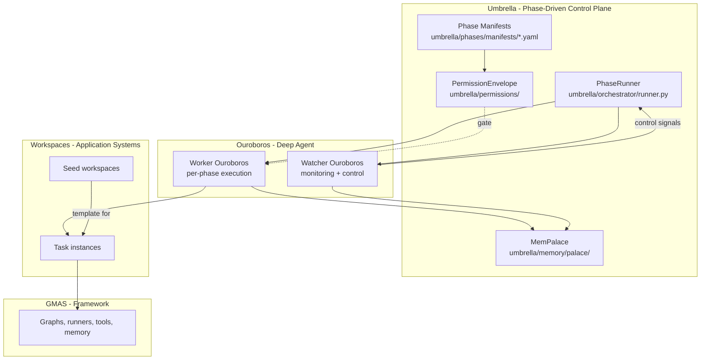
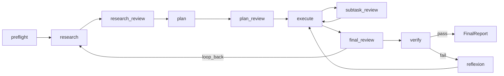
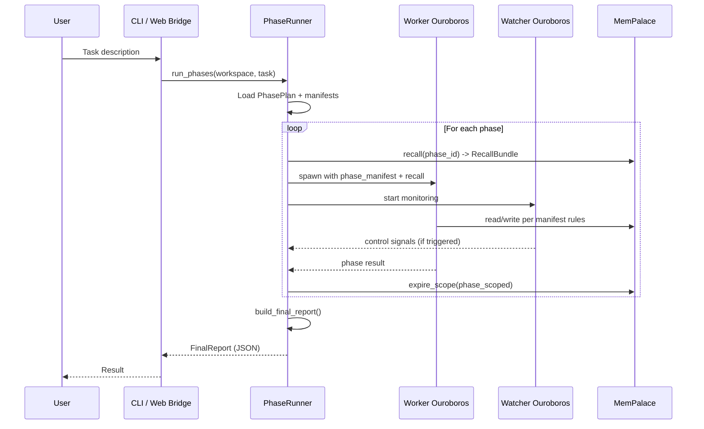

# Architecture

Umbrella is built on three layers with a phase-driven control plane that orchestrates long-running improvement cycles through deterministic phase manifests.

## Three-Layer Model



| Layer | Responsibility |
|-------|---------------|
| **GMAS** (`gmas/`) | Stable, read-only multi-agent framework. Provides execution runtime, tools, memory, callbacks. |
| **Workspaces** (`workspaces/`) | Application systems built on GMAS. Seeds are human-created templates; task-instances are mutable copies for specific tasks. |
| **Umbrella** (`umbrella/`) | Control plane: phase machine, memory, permissions, retrieval, web bridge. Owns the PhaseRunner, MemPalace, and PermissionEnvelope. |
| **Ouroboros** (`ouroboros/`) | Deep LLM agent. Spawned per-phase by the PhaseRunner as Worker or Watcher. Consumes phase manifests. |

## Phase-Driven Run Lifecycle

Every run follows a **PhasePlan** — a mutable ordered list of phases. Each phase is described by a YAML manifest that declares:

- Which **tools** and **skills** are allowed/forbidden
- Which **prompt files** to load
- Which **memory stores** to read/write
- **Exit criteria** (required tool calls, minimum palace writes)
- **Budgets** (tokens, seconds, tool calls)
- Whether a **mini-review** phase follows



### Phase Descriptions

| Phase | Purpose | Tool Access |
|-------|---------|-------------|
| **preflight** | Environment check: env vars, MCP health, palace availability, secrets | Read-only + `mcp_install` |
| **research** | Understand the task, find similar projects/patterns, draft architecture | Read-only filesystem + palace + web search + MCP |
| **research_review** | Quick verification of research output | Read-only + palace_link |
| **plan** | Build PhasePlan and subtask cards with tool/skill/test recipes | Read-only + palace + `harness_run` |
| **plan_review** | Verify plan completeness | Read-only + palace |
| **execute** | Execute each subtask card until tests pass | Full edit (within workspace only) + shell + verify |
| **subtask_review** | Review after each subtask | Read-only + palace + control tools |
| **final_review** | Check result against original goal | Read-only + real e2e tests + `loop_back_to` |
| **verify** | Final verification + promote durable knowledge | Read-only + verify + `promote_to_durable` |
| **reflexion** | Verbal self-feedback after failed verify (evidence-backed) | Read-only + palace write |

### Phase Manifest Example

```yaml
id: research
version: 1
prompt_files:
  system:
    - umbrella/prompts/phases/research.system.md
  user_overlay:
    - umbrella/prompts/phases/research.user_overlay.md
allowed_tools:
  - github_project_search
  - deep_search
  - palace_search
  - palace_add
  - read_file
forbidden_tools: [apply_workspace_patch, shell, repo_write_commit]
memory:
  always_on:
    - {store: palace.charter, tier: always_on}
  warm_search:
    - {store: palace.lesson, n: 6}
exit_criteria:
  required_calls: [submit_research_summary]
  min_palace_writes:
    - {store: palace.idea, n: 3}
mini_review_after: research_review
```

All manifests are validated against `umbrella/phases/schema/manifest.schema.json` at load time and in CI (`test_phase_manifests_valid.py`).

## Dual-Agent Pattern: Worker + Watcher

Each run spawns **two** Ouroboros agents in parallel:

### Worker

- Executes the current phase with the full tool set from the manifest.
- Receives `phase_manifest`, `tool_filter`, and `recall_bundle` in `task["context_overlays"]`.
- Can mutate the PhasePlan via `mutate_phase_plan`, `add_phase`, `loop_back_to`, `edit_subtask_card`.
- All tool calls pass through the PermissionEnvelope pre-hook.

### Watcher

- **Idle by default** — does not invoke LLM unless a trigger fires.
- Read-only access: `palace_search`, `read_drive_log`, `read_terminal_scrollback`.
- Control tools: `request_abort_phase`, `request_restart_phase`, `request_mutate_phase_plan`, `force_verify`, `inject_lesson`.
- Communicates via `drive/state/watcher_signal.json` (atomic rename-on-write).

**Watcher triggers** (deterministic heuristics in `umbrella/orchestrator/watcher_triggers.py`):

| Trigger | Condition |
|---------|-----------|
| `stall` | No progress for `OUROBOROS_WATCHER_STALL_SEC` (default 180s) |
| `shell_nonzero` | Shell returned non-zero and Worker did not react |
| `repeat_error` | Same error signature in M consecutive rounds |
| `verify_failed` | `submit_verification(fail)` called |
| `phase_overrun` | Phase exceeded token or time budget |
| `worker_panic` | Worker process crashed |
| `explicit_call` | Worker called `request_watcher_review(reason)` |

## PermissionEnvelope

Every tool call passes through a single gateway:

```
PermissionEnvelope(phase_id, tool_name, paths?, commands?) -> allow | deny(reason)
```

- Phase manifest contains a `permissions:` block with explicit allow/deny rules.
- Global hard denials in `umbrella/permissions/global.yaml` (deny on `**/.env*`, `**/secrets/**`, `git push --force`, etc.) override any phase rule.
- Pre-hook in `ToolRegistry.execute` blocks denied calls with `TOOL_DENIED_BY_ENVELOPE`.
- **Watcher** has a hardcoded read-only envelope (in Python, not YAML) that prevents any write operations.
- Agent can request `request_envelope_extension(reason)` which requires Watcher or human confirmation.

## MemPalace: Unified Memory

Memory is split along two axes: **physical stores** (by domain) and **durability scopes** (when nodes expire).

### Stores

| Store | Backend | Purpose |
|-------|---------|---------|
| `palace.charter` | Chroma | Project goal, architecture, active envelope. Always loaded. |
| `palace.lesson` | Chroma | Durable verified lessons. Semantic search. |
| `palace.idea` | Chroma | Hypotheses, findings. `verified=false` suppressed in plan/execute recall. |
| `palace.codeptr` | Chroma | External code pointers (GitHub URLs + summaries). |
| `palace.skill_index` | Chroma | Mirror of skills library for semantic `load_skill` search. |
| `palace.run` | Chroma | Current run: PhasePlan, findings, subtask results, watcher incidents. |
| `palace.phase` | Chroma | Phase scratchpad. Cleared on phase transition. |
| `palace.subtask` | Chroma | Subtask scratchpad. Cleared on `mark_subtask_complete`. |
| `palace.transient` | SQLite | Events, tool I/O, terminal scrollback. TTL 24h. |
| `palace.graph` | SQLite | Edge table: `src_id, dst_id, edge_type, weight, phase, created_at`. |

### Durability Scopes

| Scope | Lives in | Cleared when |
|-------|---------|-------------|
| `cross_run_durable` | charter, lesson, idea(verified), codeptr, skill_index | Never (only manual cold-tier archival) |
| `run_scoped` | palace.run | On run completion: verified nodes promoted, rest archived |
| `phase_scoped` | palace.phase | On transition to next phase |
| `subtask_scoped` | palace.subtask | On `mark_subtask_complete` |
| `transient` | palace.transient (SQLite) | TTL (default 24h) + hard cap |

The `tier` field (always_on / hot / warm / cold) is orthogonal to scope: tier controls **recall priority**, scope controls **lifetime**.

### Graph Edges

Edge types linking memory nodes: `derived_from`, `cites`, `tests`, `implements`, `supersedes`, `references_file`, `triggered_by_error`, `flagged_by`, `blocks`.

## Evidence-First FinalReport

After `verify(pass)`, the runner builds a structured `FinalReport` where every claim in the human summary must cite a specific `event_id` or `artifact_id`.

```json
{
  "run_id": "...",
  "workspace_id": "...",
  "status": "pass | fail | partial",
  "human_summary_md": "...",
  "claims_index": {"claim_1": ["event_42", "artifact_7"]},
  "evidence": {
    "changed_files": [...],
    "commands_run": [...],
    "verification_reports": [...],
    "watcher_incidents": [...],
    "memory_promotions": [...]
  },
  "phase_timeline": [...]
}
```

A validator rejects reports with unverified claims. On validation failure, the final phase repeats once; after a second failure, `status=partial`.

## Task Flow



## In-Run Self-Modification

During a run, the Worker can modify its own execution path (but never the manager code):

- `mutate_phase_plan(patch)` — add/remove/reorder remaining phases
- `add_phase(after, manifest)` — insert an extra phase
- `loop_back_to(phase)` — return to a previous phase
- `edit_subtask_card(subtask_id, patch)` — change goal/tests/tools
- `swap_skill_in_phase(phase_id, add, remove)` — change active skills
- `register_temp_tool(name, src, schema)` — create a temporary tool (scope = phase)

**Forbidden in normal runs** (requires separate `self_improvement_run` mode with relaxed envelope):
- Editing `umbrella/`, `ouroboros/`, `gmas/`, root configs
- Changing `umbrella/permissions/global.yaml`
- Changing manifest schemas

## Verified Reflexion

When `verify` fails, a **reflexion** mini-phase generates a verbal self-feedback node in `palace.run` with `verified=false`. This reflection is promoted to `palace.lesson` (cross-run durable) **only** when:

1. The reflection was in hot-context of a subsequent attempt
2. That attempt passed `verify(pass)`
3. A `palace.run` edge `applied_reflection -> <reflection_id>` exists

Without these conditions, the reflection stays in `palace.idea` with `verified=false` (suppressed in default recall) or dies with the run.

## Key Design Principles

1. **Workspace-first**: improve the application, not the manager.
2. **Manifest-driven**: phases are data, not hardcoded logic.
3. **Permission-gated**: every tool call passes through the envelope.
4. **Evidence-based**: reports require citations; reflexions require verification.
5. **Framework discipline**: GMAS is read-only; work within its API.
6. **Idle Watcher**: monitoring is cheap; LLM calls only on triggers.
7. **Memory as control plane**: past runs inform future decisions, not just archive.
