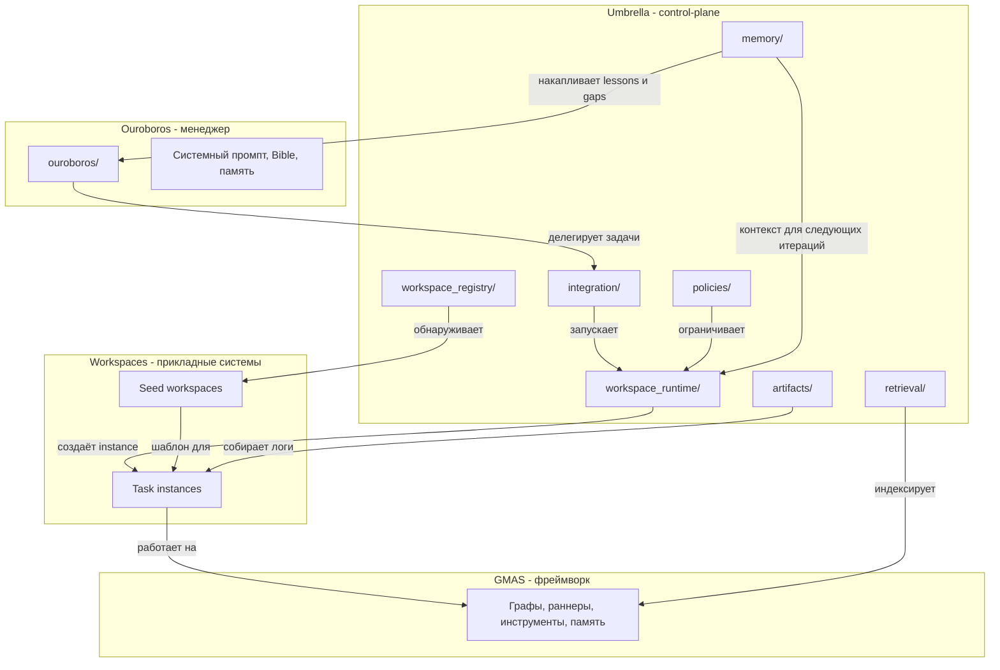
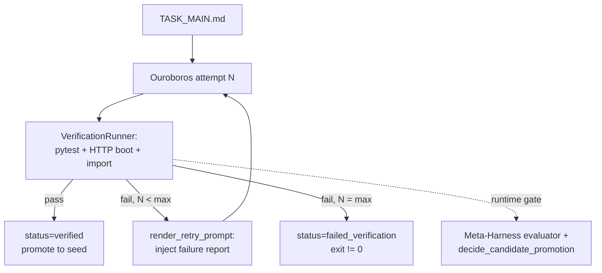
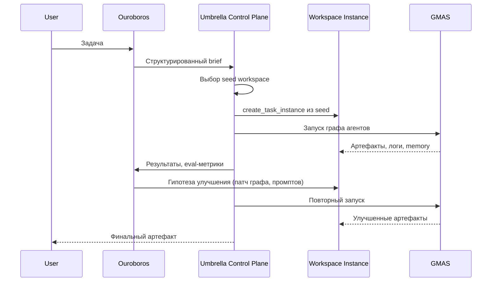

# Архитектура Umbrella

## Обзор

Umbrella построен на трёхслойной архитектуре, где каждый слой имеет чёткую зону ответственности
и уровень изменяемости. Связующую роль между слоями выполняет модуль `umbrella/` — control-plane,
который реализует политику, реестр, рантайм, retrieval и memory.

## Слой 1: GMAS (фреймворк)

GMAS — это неизменяемый vendor-like движок мультиагентных графов. Он предоставляет:

- Execution runtime (раннеры, топологии, шедулер).
- Базовые инструменты (web search, file search, MCP client, computer use).
- Память и сообщения между агентами.
- Бюджет, callback-систему, стриминг.

Политика: `gmas/` **read-only**. Автоматические патчи запрещены. Если возможностей GMAS
не хватает, решение ищется через обёртки и конфигурацию вне `gmas/`, а не через прямое
изменение фреймворка.

Документация GMAS живёт в `gmas/docs/` и `gmas/DOCUMENTATION.md`.

## Слой 2: Workspaces (прикладные системы)

Workspace — это прикладная система, заточенная под класс задач: граф агентов, промпты, роли,
инструменты, модели, evals, эксперименты и артефакты. Именно workspace даёт полезный результат
пользователю.

Workspaces делятся на два уровня:

- **Seed** — стабильный шаблон, созданный человеком. Не патчится «в лоб».
- **Task-instance** — мутабельная копия seed под конкретную задачу. Основная зона итеративного
  улучшения.

Итоговый артефакт должен быть standalone: workspace может работать и без Ouroboros.

Подробнее: [workspaces.md](workspaces.md).

## Слой 3: Ouroboros (менеджер)

Ouroboros — это менеджер и оператор контуров улучшения. Он:

- Выбирает подходящий workspace.
- Запускает его, читает логи и артефакты.
- Строит гипотезу улучшения и модифицирует workspace.
- Запускает повторно и оценивает результат.
- Только если workspace-итерации исчерпаны, переходит к самомодификации.

Ouroboros не является основным исполнителем задачи. Исполнение рождается в workspace на GMAS.

Подробнее: [ouroboros.md](ouroboros.md).

## Umbrella: связующий control-plane

Umbrella — это набор подсистем, которые связывают три слоя:

| Подсистема | Модуль | Роль |
|------------|--------|------|
| Политика | `umbrella/policies/` | Границы: что read-only, что workspace-first, когда эскалация |
| Реестр | `umbrella/workspace_registry/` | Обнаружение seed/instance, метаданные, lineage |
| Рантайм | `umbrella/workspace_runtime/` | Создание instance, запуск через адаптеры, snapshot |
| Retrieval | `umbrella/retrieval/` | BM25 + символьный поиск по GMAS, docs index, workspace usage |
| Артефакты | `umbrella/artifacts/` | Индексация запусков, логи, сравнение результатов |
| Интеграция | `umbrella/integration/` | Мост к Ouroboros: launcher, drive, bridge |
| Memory | `umbrella/memory/` | Lessons, competency ledger, palace backend, prompt-ready context |

Подробнее: [umbrella-layer.md](umbrella-layer.md).

## Verification loop (runtime-гейт)

Между самозавершением Ouroboros и применением изменений теперь стоит
обязательный этап **runtime verification** — набор шагов, объявленных в
`workspace.toml` (секция `[verification]`), либо автоматически выведенных
(`test_smoke.py`, `web_server.py` HTTP-health, `main.py` import-check).
Шаги исполняются реальным subprocess'ом в рабочей директории workspace.

Ключевые точки интеграции:

- `umbrella.verification` — runner, spec_loader, auto-detect
  ([umbrella/verification/](../umbrella/verification)).
- `umbrella.control_plane.ouroboros_integration.run_ouroboros_improvement_sync`
  вызывает verification после каждой итерации и возвращает
  `status ∈ {verified, failed_verification, incomplete, error}`;
  `promote=True` эффектен только при `verified`.
- `umbrella/app_ouroboros.py` и `run_ouroboros_self_improve.py` реализуют
  verify-then-retry (до `--max-verify-retries+1` попыток) и подмешивают
  `Previous Verification Failure` в retry-prompt.
- `umbrella/meta_harness/evaluator.py` включает `runtime_verification`
  компонент в weighted score (0.15).
- `umbrella/meta_harness/promotion.py::decide_candidate_promotion` отклоняет
  кандидата, если любой required verification step упал.

## Внешний контур: Meta-Harness

Поверх обычного цикла Ouroboros → workspace → GMAS добавлен **Meta-Harness** — слой
экспериментов над «harness» (промпты, интеграция, политика, память, инструменты Ouroboros),
с явным хранением кандидатов и оценкой на **search set** до promotion.

- Код: `umbrella/meta_harness/` (store, capture, evaluator, promotion, search_sets, CLI).
- Данные: `.umbrella/meta_harness/experiments/<experiment_id>/...` — манифесты, снимки,
  execution/evaluation, диффы.
- Запуск: `run_meta_harness.py` или `uv run python -m umbrella.meta_harness`.
- Связь с непрерывным улучшением: `run_ouroboros_self_improve.py`
  может принимать решение о promotion **после** оценки кандидата, если в результате итерации
  есть `candidate_id`.

Идейный план и мотивация: [meta-harness-improvement-plan.md](meta-harness-improvement-plan.md).

## Поток решения задачи

Полный цикл:

1. Принять задачу, привести к структурированному brief.
2. Определить класс задачи.
3. Выбрать seed workspace.
4. Создать task-instance.
5. Поднять контекст по GMAS, по workspace, по прошлым кейсам.
6. Запустить workspace.
7. Прочитать логи, eval-результаты и артефакты.
8. Построить гипотезу улучшения.
9. Изменить workspace.
10. Повторить цикл запуска и оценки.
11. Вернуть артефакт и сохранить уроки.
12. Если цикл упёрся в ограничения менеджера — вторичный self-improvement контур.

## Память как сквозной слой

Хотя memory физически находится внутри `umbrella/`, по смыслу это сквозной слой всей системы.
Он связывает прошлые запуски, текущий выбор стратегии и решение о том, где именно менять систему.

Memory в Umbrella хранит:

- lessons по workspace-итерациям;
- manager-level lessons, применимые к нескольким workspace;
- competency signals и gaps;
- palace/hierarchical knowledge с тематической таксономией;
- компактные summary bundles для prompt injection.

Именно memory помогает ответить на ключевой вопрос архитектуры:
это проблема текущего workspace, проблема выбора стратегии или уже проблема самого менеджера.

Подробнее: [umbrella-layer.md](umbrella-layer.md).

## Ключевые нововведения

Если смотреть идейно, `Umbrella` предлагает не просто ещё одного coding-агента, а другую
операционную модель построения AI-систем:

1. **Workspace-first вместо self-first**.
   Прикладная компетенция и основные изменения должны кристаллизоваться в `workspaces`, а не в коде менеджера.

2. **Seed / instance / promotion lifecycle**.
   Есть явный жизненный цикл: человек создаёт seed, менеджер материализует instance под задачу, затем полезные изменения могут возвращаться обратно в seed.

3. **Менеджер отделён от продукта**.
   `Ouroboros` и `umbrella` отвечают за выбор, оценку, память и orchestration, но итоговый полезный артефакт должен жить отдельно от них.

4. **Формализованный self-improvement**.
   Самоулучшение не является default-реакцией. Оно включается по сигналам, gaps и policy-триггерам.

5. **Control-plane с памятью и retrieval**.
   Решения принимаются не только по текущему контексту, но и по накопленным lessons, semantic memory и retrieval по `GMAS`.

6. **Framework discipline**.
   `GMAS` выступает как стабильный execution substrate, а не как поверхность для спонтанного автопатчинга.

7. **Meta-Harness как внешняя проверка улучшений**.
   Изменения harness-level не обязаны считаться успешными только потому, что итерация завершилась;
   по возможности они проходят оценку на заранее заданном наборе задач и решение о promotion
   отделено от «просто сделал правки».

## Политика границ

Правила закреплены в `umbrella/policies/default_policy.yaml` и в коде `umbrella/policies/engine.py`.

| Путь | Политика | Эскалация |
|------|----------|-----------|
| `gmas/**` | Read-only | Требуется одобрение человека |
| `ouroboros/**` | Mutable при self-improvement | Уведомление человека |
| `workspaces/<seed>/` | Seed: только через promotion | Требуется evidence + min score 0.7 |
| `workspaces/.../instances/**` | Свободно изменяем | Нет |
| `umbrella/**` | Свободно изменяем | Нет |

Ключевые API решений:

- `classify_path(path)` — категория поверхности (framework, manager, workspace_instance, ...).
- `can_edit_path(path, actor, action)` — разрешение на запись.
- `should_prefer_workspace_patch(context)` — предпочтение workspace-патча.
- `can_trigger_self_improvement(context)` — допустим ли self-improvement.

Подробнее: `umbrella/policies/README.md`.
