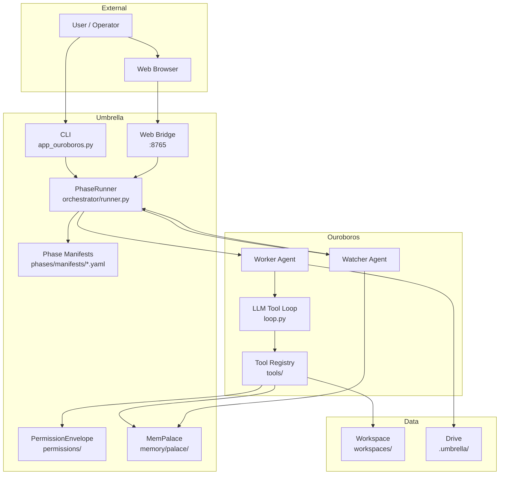

# Part 2: System Context

This chapter describes the roles of each major component and how they interact in a single narrative.

## Component Roles

### GMAS (`gmas/`)

The stable multi-agent framework. Provides graph execution, tools, memory between agents, budget control, callbacks, and streaming. Treated as a read-only vendor dependency.

### Workspaces (`workspaces/`)

Application systems built on GMAS. Each workspace contains agent graphs, prompts, models, evals, and experiments. Seeds are human-created templates; task-instances are mutable copies for specific tasks.

### Umbrella (`umbrella/`)

The phase-driven control plane. Owns:
- **Phase machine** (`phases/`): YAML manifests describing what each phase can do.
- **Orchestrator** (`orchestrator/`): PhaseRunner that walks the plan, spawns agents.
- **Memory** (`memory/palace/`): MemPalace facade with tiered stores.
- **Permissions** (`permissions/`): PermissionEnvelope gating all tool calls.
- **Retrieval** (`retrieval/`): Search over GMAS code and docs.
- **Web bridge** (`web_bridge/`): HTTP server with JSON API and React UI.

### Ouroboros (`ouroboros/`)

The deep LLM agent. Spawned by PhaseRunner as Worker or Watcher. Consumes phase manifests. Contains the tool loop (`loop.py`), LLM client (`llm.py`), context builder (`context.py`), and 22 tool modules.

### Supervisor (`ouroboros/supervisor/`)

Process management, event dispatch, Telegram notifications, task queue, state persistence, and git operations for Ouroboros workers.

## Interaction Diagram

## Data Flow in a Run

1. User provides a task (CLI or Web UI).
2. PhaseRunner loads the PhasePlan and the first manifest.
3. For each phase:
   - MemPalace builds a `RecallBundle` for the phase.
   - Worker is spawned with manifest, tool filter, and recall bundle.
   - Watcher starts monitoring (idle by default).
   - Worker executes tool calls, gated by PermissionEnvelope.
   - Worker writes findings to MemPalace stores.
   - On trigger, Watcher sends a control signal.
   - Runner processes signals (abort, restart, mutate plan).
   - Phase completes, Runner advances to next phase.
4. After verify(pass), Runner builds FinalReport with evidence.
5. Verified memory nodes are promoted to cross-run durable stores.

---

Next: [Part 3 — Repository Topology](03-repository-topology.md)
