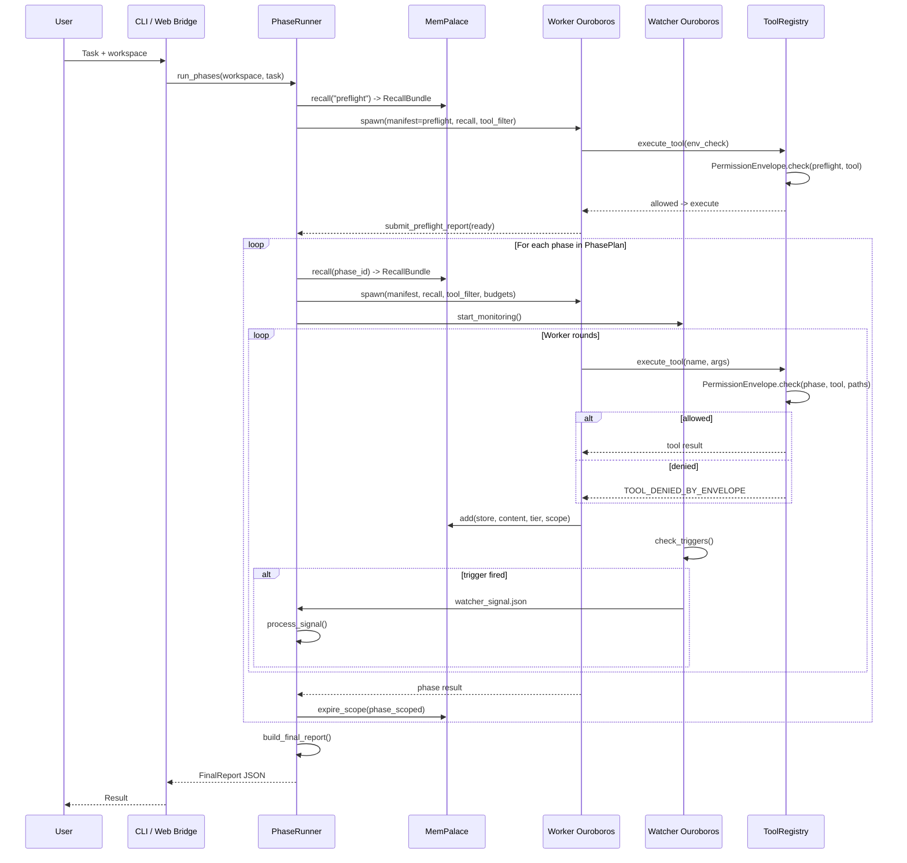
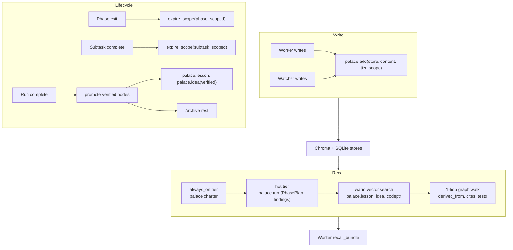
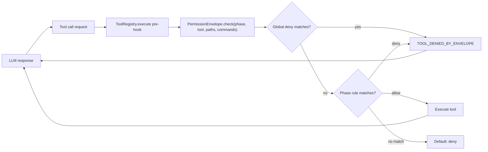
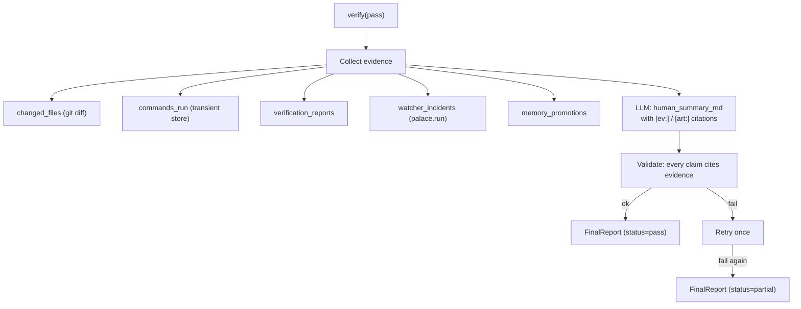

# Part 5: Layers and Data Flows

This chapter traces the data flow from operator input through the phase machine to the final report.

## Phase Execution Flow

## Memory Flow

## Permission Enforcement Flow

## FinalReport Flow

## Watcher Signal Protocol

1. Watcher detects trigger condition.
2. Watcher writes `WatcherSignal` JSON to `drive/state/watcher_signal.json` (atomic rename).
3. Runner reads signal on next Worker round boundary or phase boundary.
4. Runner deduplicates by `signal_id` against `watcher_signals.processed.jsonl`.
5. Runner applies signal: abort, restart, mutate plan, force verify, inject lesson.
6. Signal is logged to `palace.run` with edge `flagged_by=watcher`.

---

Next: [Part 6 — Umbrella Subsystems](06-umbrella-subsystems.md)
