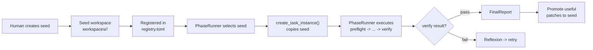

# Part 7: Workspaces and Policy

## Workspace Lifecycle



## Seed Workspace

A seed is a version-controlled template in `workspaces/<id>/`:

- `workspace.toml` — contract: ID, name, file references, mutable paths.
- `TASK_MAIN.md` — general mission description.
- `seed_profile.toml` (optional) — capabilities, task classes, selection hints for automatic matching.
- `graph/topology.toml` — GMAS agent graph.
- `agents/`, `prompts/`, `tools/`, `models/`, `evals/`, `experiments/` — workspace content.

Seeds are protected: automatic patches require promotion with minimum eval score 0.7.

## Task-Instance

Created by `umbrella/workspace_runtime/instances.py::create_task_instance()`:

1. Copy seed files (excluding runtime directories).
2. Create runtime directories: `runs/`, `snapshots/`, `reports/`, `memory/`, `logs/`.
3. Set new `workspace_id` linked to `task_id`.
4. Initialize `TASK_MAIN.md` from task brief.
5. Record lineage (`WorkspaceLineageRecord`).

Instances are the mutable surface during execution. The Worker can freely modify files within the instance directory (enforced by PermissionEnvelope path policy).

## PermissionEnvelope Path Rules

During the **execute** phase, the path policy restricts writes to the workspace instance:

```yaml
rules:
  - allow_tool: shell
    args:
      working_directory: "workspaces/${workspace_id}/**"
      cmd_re: "^(pytest|npm|node|python|uvx|git\\s+(status|diff|log))\\s"
  - deny_path: ["**/.env*", "**/secrets/**", ".git/**", "umbrella/**", "ouroboros/**", "gmas/**"]
```

Global denials in `umbrella/permissions/global.yaml` add hard blocks on:
- `**/.env*`, `**/secrets/**` — secrets
- `.git/**` — git internals
- `gmas/**` — framework code
- `umbrella/**`, `ouroboros/**` — system code (except in self-improvement mode)

## Boundary Rules

| Path | Policy | Escalation |
|------|--------|------------|
| `gmas/**` | Read-only | Human approval required |
| `ouroboros/**` | Mutable in self-improvement mode | Notification |
| `workspaces/<seed>/` | Seed: only through promotion | Evidence + min score 0.7 |
| `workspaces/.../instances/**` | Freely mutable | None |
| `umbrella/**` | Mutable in self-improvement mode | Notification |

Policy engine: `umbrella/policies/engine.py` (`PolicyEngine`).

## Promotion

When a run completes with `verify(pass)`:

1. Worker's changes are in the task-instance directory.
2. Useful patches can be promoted back to seed.
3. Promotion requires: evidence of improvement, eval score >= 0.7, human review (configurable).
4. `umbrella/orchestrator/promotion.py` manages the promotion process.

## In-Run Self-Modification

The Worker can modify its execution path (not the system code):

- `mutate_phase_plan(patch)` — change remaining phases
- `add_phase(after, manifest)` — insert extra phase
- `loop_back_to(phase)` — return to a previous phase
- `edit_subtask_card(id, patch)` — change subtask recipe
- `swap_skill_in_phase(phase, add, remove)` — change active skills
- `register_temp_tool(name, src, schema)` — create temporary tool

All mutations are logged in `PhasePlan.edits_log` with `version` incremented.

---

Next: [Part 8 — Ouroboros Runtime](08-ouroboros-runtime.md)
