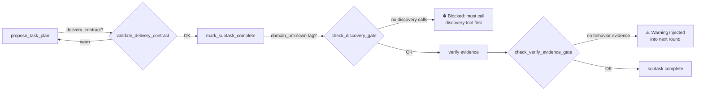

# Часть 8. Ouroboros как рантайм менеджера

[← Оглавление](README.md) · [← Часть 7](07-workspaces-and-policy.md) · [Далее: verification →](09-verification.md)

---

## 8.1 Два места, где живёт «Ouroboros» в коде

Ouroboros реализован в двух самостоятельных зонах репозитория:

| Зона | Модуль | Что делает |
|------|--------|------------|
| `ouroboros/` | Цикл, плановщик, инструменты, память | Исполнение итерации: LLM-раунды, tool-calling, subtask-декомпозиция |
| `umbrella/control_plane/ouroboros_integration.py` | Интеграция с Umbrella | Поднимает цикл в своём процессе, собирает git-диффы, обрабатывает verification-outcome, прикрепляет candidate-id |

!!! warning "При отладке не смешивайте уровни"
    Падение в `ouroboros/loop.py` и отказ в `ouroboros_integration.py` — разные классы инцидентов с разными точками входа в логах.

---

## 8.2 Инструменты и граница доверия

Ouroboros действует через инструменты, которые экспонирует Umbrella: файловая система workspace, pytest-обвязка, retrieval, память, управляющие вызовы. Это сознательное ограничение поверхности: менеджер не получает произвольный `exec` по всему диску без прохождения слоя инструментов.

Перечень инструментов эволюционирует; ориентир — `ouroboros/ouroboros/tools/` и `umbrella/mcp/registry.py` для MCP.

---

## 8.3 Adaptive Task Planner

> Ключевое нововведение в `ouroboros/ouroboros/task_planner.py`.

До появления плановщика `run_llm_loop` работал как единый линейный поток LLM-раундов: агент получал `TASK_MAIN` и обрабатывал всё сразу до финального ответа. Для нетривиальных задач это нестабильно — контекст разрастается безгранично, частичный прогресс не фиксируется, перезапуск заново восстанавливает намерение «с нуля».

Плановщик добавляет три ортогональные возможности **без жёсткой привязки к домену**:

=== "1. Декомпозиция"
    **Upfront decomposition** — выделенный «planner-раунд» запрашивает у LLM структурированный список подзадач (`propose_task_plan`). Каждая подзадача имеет `title`, `description` и `success_check`. План — небольшой JSON, сохраняемый в `drive/task_plans/`.

=== "2. Фокусированное исполнение"
    **Sequential execution with focus block** — оркестратор проходит план по одной подзадаче, инжектируя системное сообщение `[SUBTASK i/N]` перед каждой фазой. Фаза заканчивается, когда LLM вызывает `mark_subtask_complete`.

=== "3. Адаптивный реплан"
    **Adaptive replanning** — после каждой подзадачи короткая review-фаза позволяет LLM вызвать `revise_remaining_plan` с новым хвостом плана. Число ревизий ограничено, чтобы исключить осцилляции.

### Конфигурация плановщика

| Переменная окружения | Значения | По умолчанию | Смысл |
|---------------------|----------|-------------|-------|
| `OUROBOROS_PLANNER_MODE` | `auto` / `always` / `off` | `auto` | `auto` — включить для задач длиннее 220 символов; `off` — CI, чат |
| `OUROBOROS_PLANNER_MAX_STEPS` | целое 1–20 | `7` | Максимальное число подзадач |
| `OUROBOROS_REQUIRE_PLANNER_DISCOVERY` | `1` / `0` | `1` | Блокировать завершение плана до вызова discovery-инструментов |

### Как план сохраняется

```
workspaces/<id>/.memory/drive/task_plans/
    <task_id>.json                 # активный план
    <task_id>.before_remediation_<n>.json  # снимок перед реплланированием
```

Файл плана — канонический источник состояния. `HierarchicalMemory` зеркалирует завершённые подзадачи как recall-записи, но оркестратор для возобновления всегда читает файл плана, а не память.

---

## 8.4 Control Gates (`ouroboros/ouroboros/tools/control.py`)

`control.py` — тонкий адаптер над Umbrella control-plane API. Логика владения фазами, governance промптов, human-checkpoints и семантика promotion остаются в `umbrella.control_plane` / `umbrella.memory`.

Модуль реализует набор **completion gates** — проверок, блокирующих преждевременное закрытие плана, подзадачи или remediation при отсутствии discovery- или verification-evidence.



### Delivery contract

`propose_task_plan` требует поля `delivery_contract` — объект, описывающий:

- `outcome` — что получает пользователь в рантайме;
- команду/проверку, доказывающую результат;
- ожидаемый артефакт/файл/HTTP-ответ.

Отсутствие или пустой `delivery_contract` вызывает предупреждение, не блокируя исполнение.

### Discovery gate

Подзадачи с тегом `domain_unknown` (неизвестная технология или незнакомое API) **не могут** быть завершены через `mark_subtask_complete` без предшествующего вызова хотя бы одного discovery-инструмента:

```python
_DISCOVERY_SOURCE_TOOLS = {
    "web": {"deep_search", "web_fetch"},
    "github": {"github_project_search", "github_extract_snippets"},
    "mcp": {"mcp_discover", "mcp_install"},
    ...
}
```

### Behavior evidence gate

`_check_verify_evidence_gate` проверяет, что в тексте итерации присутствуют признаки реального запуска (не просто импорта):

```python
_BEHAVIOR_EVIDENCE_RE = re.compile(
    r"(?i)\b(run_workspace_verify|pytest|test[s]? passed|"
    r"created .*\.(?:pptx|pdf|png|jpg|csv|json)|"
    r"exit_code\s*[=:]\s*0|http\s+200)\b"
)
```

При отсутствии таких признаков в раунд инжектируется предупреждение — но это **не hard-block**, а мягкая сигнализация.

---

## 8.5 Память

Менеджер ведёт долгую память (lessons, сигналы компетенций) через hook'и и storage под `ouroboros/` и `.umbrella`. Продуктовое описание контура: [../ouroboros.md](../ouroboros.md).

Drive-layout создаётся под `.umbrella/ouroboros_drive/` (или под `workspaces/<id>/.memory/drive/` при запуске через umbrella-workspace flow):

```
drive/
    logs/
        events.jsonl
        round_io.jsonl
        tools.jsonl
        verification_failures.jsonl
    memory/
        knowledge/
    state/
        state.json
        run_snapshot.json
    task_plans/        # файлы плановщика
    task_results/
```

---

## 8.6 Лимиты раундов

Umbrella может экспортировать `OUROBOROS_MAX_ROUNDS` из флага `--max-rounds` (`app_ouroboros.py`), чтобы согласовать «безлимитный» CLI с внутренним потолком цикла менеджера.

!!! note "Исторический cap"
    Несогласованность `OUROBOROS_MAX_ROUNDS` historically давала тихий cap на 200 итераций — см. комментарии в коде `_apply_max_rounds_env`.

---

## 8.7 Self-improvement как вторичный контур

Когда основной контур (правки workspace) исчерпывает себя, политика может инициировать улучшение самого менеджера. Это **не** отменяет workspace-first дисциплину: после обновления инструментария цикл возвращается к работе с прикладным пакетом.

Триггеры (из `default_policy.yaml`):

| Триггер | Порог |
|---------|-------|
| Повторяющиеся неудачи workspace-итераций | `min_repeated_failures: 3` |
| Стагнация без прогресса | `min_stalled_iterations: 5` |
| Низкий confidence retrieval по GMAS | `retrieval_confidence_threshold: 0.3` |

---

Далее формальный гейт качества — [09-verification.md](09-verification.md).
