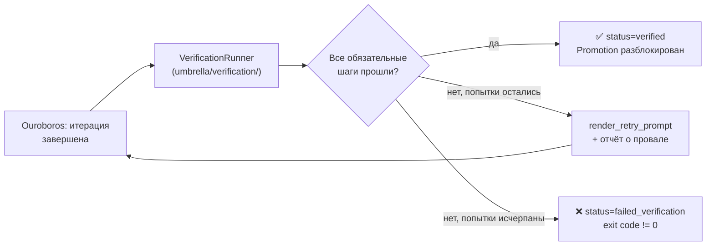

# Часть 9. Verification: спека, исполнение, retry

[← Оглавление](README.md) · [← Часть 8](08-ouroboros-runtime.md) · [Далее: Web bridge →](10-web-bridge.md)

---

## 9.1 Смысл verification в архитектуре

Verification — это **независимый гейт** после того, как Ouroboros считает итерацию завершённой. Он отвечает на вопрос: «если запустить проверки снова с нуля, они проходят?» Это ближе к CI, чем к самооценке LLM.



---

## 9.2 Откуда берётся спецификация

Приоритет загрузки (через `umbrella/verification/spec_loader.py`):

1. **Явная секция `[verification]`** в `workspace.toml` workspace.
2. **Авто-детект** — типичные smoke-тесты (`test_smoke.py`), HTTP health для объявленного `web_server.py`.

Если спека неконсистентна, отчёт может помечать `repairable` / `spec_error` — тогда retry имеет смысл не «ещё раз наугад», а с правкой конфигурации.

---

## 9.3 Структура отчёта

Отчёт — JSON-совместимая структура с:

- Списком **шагов** (`name`, `status`, `optional`, `output`).
- Человекочитаемым `summary`.
- Флагами `passed` / `failed` / `repairable` / `spec_error`.

```json
{
  "summary": "2/3 steps passed",
  "steps": [
    {"name": "pytest", "status": "passed", "optional": false},
    {"name": "import_check", "status": "passed", "optional": false},
    {"name": "mock_scaffold_scan", "status": "failed", "optional": false,
     "output": "Found: 'News 1' (numbered news placeholder) in src/pipeline.py:42"}
  ]
}
```

Последняя копия сохраняется для UI и постмортема в `.umbrella/ouroboros_drive/` (или в workspace drive).

---

## 9.4 Source Policy Scanner

> Новый компонент: `umbrella/verification/source_policy.py`

`source_policy.py` расширяет verification дополнительным слоем: **сканированием исходного кода workspace на наличие заглушек и scaffold-маркеров**. Это предотвращает ситуацию, когда workspace «проходит» pytest, но при этом содержит нереализованный код с маркерами вроде `News 1`, `Point 2`, `lorem ipsum` или `# TODO: implement`.

### Паттерны, которые он ищет

В дополнение к `_MOCK_SCAFFOLD_PATTERNS` из `umbrella/verification/skill_compliance.py`:

| Название паттерна | Пример совпадения |
|-------------------|--------------------|
| `numbered news placeholder` | `News 1`, `News 2` |
| `numbered point placeholder` | `Point 1`, `Point 2` |
| `placeholder image url` | `via.placeholder.com/...` |
| `lorem ipsum` | `Lorem ipsum dolor sit amet` |
| `future implementation marker` | `will be implemented`, `not implemented yet` |
| `phase scaffold marker` | `Phase 1-2 implement` |

### Что исключается из сканирования

Сканер **не** проверяет:

=== "По расширению"
    `.pptx`, `.png`, `.jpg`, `.jpeg`, `.gif`, `.webp`, `.pdf`, `.zip` — бинарные файлы.

=== "По glob-паттернам"
    Мета-файлы, которые по смыслу обязаны содержать описания паттернов:

    ```
    **/verification/**
    **/record_verification_lessons*
    **/.memory/**
    **/docs/**
    **/workspace.toml
    **/verification.toml
    **/TASK_MAIN.md
    ```

!!! tip "Историческая причина исключений"
    Самый болезненный production-баг — агент «самофлагировал» `record_verification_lessons.py`, потому что тело урока буквально объясняло паттерн `Point 1 / Point 2 / Point 3`, который и триггерил `mock_scaffold_scan`. Исключения мета-файлов устранили этот класс ложных срабатываний.

### Как интегрировать в workspace.toml

```toml
[verification]
steps = [
  { type = "pytest", path = "tests/" },
  { type = "import_check", module = "src.news_cards.pipeline" },
  { type = "source_policy_scan", paths = ["src/"] }
]
```

---

## 9.5 Retry и промпт

При провале Umbrella формирует блок **Previous Verification Failure** (`render_retry_prompt` в orchestration), который попадает в следующую попытку. Это связывает «инженерный» лог pytest/HTTP с текстом, который видит модель.

CLI-параметры:

| Параметр | Описание |
|----------|----------|
| `--max-verify-retries N` | Сколько **дополнительных** попыток после первой (итого = 1 + N) |
| `--no-verify` | Отключает гейт (legacy, ослабляет гарантии) |
| `--verification-timeout-seconds S` | Общий потолок времени на проход verification |

Для Web UI дефолт retries задаётся через `OUROBOROS_WEB_MAX_VERIFY_RETRIES` в коде bridge (по умолчанию 20).

---

## 9.6 Связь с promotion

!!! danger "Promotion без verification"
    Пока verification не дала успех для **обязательных** шагов, promotion улучшений обратно в seed и решения Meta-Harness **не должны** считаться безопасными. Это ключевая защита от «зелёного» текста без зелёных тестов.

Статусы итерации после verification:

| Статус | Смысл | Promotion |
|--------|-------|-----------|
| `verified` | Все обязательные шаги прошли | Разрешён |
| `failed_verification` | Хотя бы один обязательный шаг упал | Заблокирован |
| `incomplete` | Итерация не дошла до verification | Заблокирован |
| `error` | Системная ошибка в runner | Заблокирован |

См. также [12-meta-harness.md](12-meta-harness.md).

---

Далее операторский HTTP слой: [10-web-bridge.md](10-web-bridge.md).
