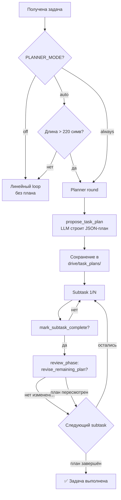
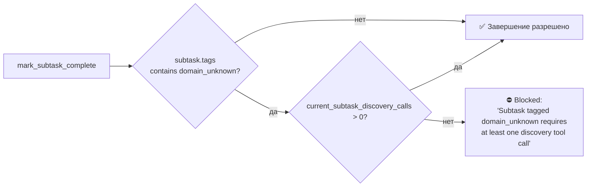

# Часть 15. Adaptive Task Planner

[← Оглавление](README.md) · [← Часть 14](14-testing-and-docs.md)

---

## 15.1 Зачем он появился

До введения плановщика `run_llm_loop` работал в едином линейном потоке: LLM получал полный текст задачи и работал с ним до тех пор, пока не выдавал финальный ответ. Для небольших задач это работало. Для многошаговых — нет:

- Контекст рос неограниченно; модель теряла фокус.
- Частичный прогресс не фиксировался: при перезапуске всё начиналось с нуля.
- Невозможно было отследить, на каком именно шаге агент завис или выбрал неправильную стратегию.

**Плановщик** (`ouroboros/ouroboros/task_planner.py`) решает эти проблемы, добавляя структуру **без привязки к домену** — он одинаково работает для ML-задач, web-приложений, data-пайплайнов и любых других.

---

## 15.2 Три принципа плановщика



### Принцип 1: Декомпозиция (upfront decomposition)

При старте итерации — выделенный «planner-раунд»: LLM вызывает `propose_task_plan` и возвращает структурированный список подзадач.

Каждая подзадача содержит:

```json
{
  "id": "subtask_1",
  "title": "Создать GMAS граф агентов",
  "description": "Настроить 4-агентный граф: thesis_parser → card_generator → slide_assembler → qa_agent",
  "success_check": "Graph создан, MACPRunner импортируется без ошибок",
  "tags": ["implementation"]
}
```

Доступные теги для подзадач:

| Тег | Смысл |
|-----|-------|
| `implementation` | Создание кода |
| `domain_unknown` | Технология незнакома агенту — требуется discovery |
| `discovery` | Поиск/исследование |
| `verification` | Проверка результатов |
| `refactor` | Рефакторинг |

### Принцип 2: Фокусированное исполнение

Оркестратор проходит план по одной подзадаче. Перед каждой фазой в системное сообщение инжектируется:

```
[SUBTASK 2/5: Создать GMAS граф агентов]
Цель: Настроить 4-агентный граф...
Критерий успеха: Graph создан, MACPRunner импортируется без ошибок
```

Фаза заканчивается вызовом `mark_subtask_complete`. Этот вызов проходит через **completion gates** — систему проверок (см. раздел 15.4).

### Принцип 3: Адаптивный реплан

После каждой подзадачи — короткая review-фаза. LLM может:

- Оставить оставшийся план без изменений (типичный случай).
- Вызвать `revise_remaining_plan` с новым хвостом, если выяснилось, что следующие шаги неактуальны.

Число ревизий ограничено (`OUROBOROS_PLANNER_MAX_REVISIONS`, по умолчанию 3) — чтобы исключить бесконечный реплан.

---

## 15.3 Конфигурация

=== "Переменные окружения"
    | Переменная | Допустимые значения | По умолчанию | Описание |
    |-----------|---------------------|-------------|----------|
    | `OUROBOROS_PLANNER_MODE` | `auto` / `always` / `off` | `auto` | Режим включения плановщика |
    | `OUROBOROS_PLANNER_MAX_STEPS` | целое 1–20 | `7` | Максимальное число подзадач |
    | `OUROBOROS_REQUIRE_PLANNER_DISCOVERY` | `1` / `0` | `1` | Блокировать план без discovery-вызовов |
    | `OUROBOROS_PLANNER_MAX_REVISIONS` | целое ≥ 0 | `3` | Максимум ревизий плана |

=== "Режимы AUTO_MIN_TASK_CHARS"
    В режиме `auto` задачи короче `AUTO_MIN_TASK_CHARS_DEFAULT` (220 символов) считаются разговорными и обходят плановщик. Порог переопределяется через env:

    ```bash
    OUROBOROS_AUTO_MIN_TASK_CHARS=400
    ```

=== "Отключение для CI"
    Для быстрых задач (дым-тесты, чат) рекомендуется:

    ```bash
    OUROBOROS_PLANNER_MODE=off
    ```

---

## 15.4 Completion Gates

Completion gates — система проверок в `ouroboros/ouroboros/tools/control.py`, которая предотвращает преждевременное закрытие фаз при отсутствии реальных доказательств работы.

### Gate 1: Delivery Contract

При вызове `propose_task_plan` проверяется наличие `delivery_contract` — объекта с описанием финального пользовательского результата:

```json
{
  "delivery_contract": {
    "outcome": "Готовый .pptx файл с 5 слайдами",
    "proof_command": "python -c \"from src.news_cards.pipeline import run_full_pipeline; print('OK')\"",
    "artifact": "output/news_cards.pptx"
  }
}
```

!!! warning "Отсутствие delivery_contract"
    Отсутствие или пустой объект вызывает предупреждение в следующем раунде, но не блокирует исполнение. Цель — напомнить агенту сформулировать критерий «готовности».

### Gate 2: Discovery Gate (для domain_unknown)

Подзадачи с тегом `domain_unknown` **не могут** завершиться без предшествующего вызова хотя бы одного discovery-инструмента:



Discovery-инструменты, засчитываемые гейтом:

| Группа | Инструменты |
|--------|-------------|
| `web` | `deep_search`, `web_fetch` |
| `github` | `github_project_search`, `github_extract_snippets` |
| `mcp` | `mcp_discover`, `mcp_install` |

### Gate 3: Planner Discovery Gate

При завершении planner-фазы (до выполнения подзадач) также проверяется: была ли выполнена хоть одна discovery-операция? Управляется через `OUROBOROS_REQUIRE_PLANNER_DISCOVERY=1` (по умолчанию включено).

### Gate 4: Behavior Evidence Gate

После `mark_subtask_complete` система проверяет наличие в тексте итерации признаков реального исполнения (не просто импорта). Паттерны:

```python
_BEHAVIOR_EVIDENCE_RE = re.compile(
    r"(?i)\b(run_workspace_verify|pytest|test[s]? passed|"
    r"created .*\.(?:pptx|pdf|png|jpg|csv|json|html|docx)|"
    r"exit(?:_code)?\s*[=:]\s*0|exit\s+0|http\s+200|cli)\b"
)
```

!!! info "Мягкая проверка"
    Это **предупреждение**, а не hard-block. Если поведенческих признаков нет, в следующий раунд инжектируется сигнал с рекомендацией запустить что-то измеримое.

---

## 15.5 Файловое состояние плана

```
workspaces/<id>/.memory/drive/task_plans/
    <task_slug>.<task_hash>.json
    <task_slug>.<task_hash>.before_remediation_<attempt>.<timestamp>.json
```

Структура файла плана:

```json
{
  "task_id": "sync_improve_web_a40b85c6",
  "created_at": "2026-05-12T03:14:22Z",
  "status": "in_progress",
  "delivery_contract": { ... },
  "subtasks": [
    {
      "id": "subtask_1",
      "title": "...",
      "description": "...",
      "success_check": "...",
      "tags": ["implementation"],
      "status": "completed",
      "completed_at": "2026-05-12T03:21:05Z"
    },
    {
      "id": "subtask_2",
      "status": "in_progress",
      ...
    }
  ],
  "revision_count": 1
}
```

---

## 15.6 Связь с Memory

По завершении каждой подзадачи `HierarchicalMemory` создаёт recall-запись, позволяя:

- Находить прогресс из прошлых прогонов по схожим задачам.
- Обогащать контекст следующей итерации знанием «что уже сделано».

!!! note "Принцип приоритета"
    Оркестратор для **возобновления** всегда читает файл плана, а не память. Память — вспомогательный поиск, не авторитетный источник состояния.

---

## 15.7 Проверка работы плановщика

Тесты completion gates (без запуска полного loop):

```bash
uv run pytest ouroboros/tests/test_completion_gates.py -v
```

Что покрывают тесты (Tier 1.3 + Tier 3.1 + Tier 3.2):

- `test_check_discovery_gate_*` — gate для `domain_unknown` subtasks.
- `test_planner_discovery_gate_*` — gate для planner-фазы.
- `test_behavior_evidence_warning_*` — паттерны behavior evidence.
- `test_validate_delivery_contract_*` — валидация delivery_contract.
- `test_check_verify_evidence_gate_*` — verify-evidence gate.

---

[↑ В начало раздела](README.md)
