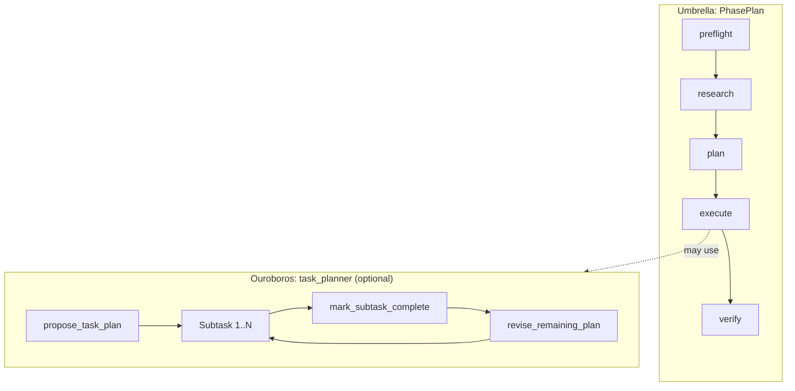

# Part 15: Planning — PhasePlan vs Adaptive Task Planner

[← Table of contents](README.md) · [← Part 14](14-testing-and-docs.md)

---

## 15.1 Two planning layers

After the refactor, **planning** spans two complementary layers:

| Layer | Owner | Artifact | Purpose |
|-------|--------|----------|---------|
| **Macro (phases)** | Umbrella `PhaseRunner` | `PhasePlan` in `drive/state/phase_plan.json` | Ordered phases: preflight, research, plan, execute, final_review, verify, reflexion. Each phase has a YAML **PhaseManifest** (tools, skills, memory, permissions, exit criteria). |
| **Micro (subtasks inside the loop)** | Ouroboros `task_planner.py` | JSON under `drive/task_plans/` | Optional adaptive decomposition: `propose_task_plan`, per-subtask focus, `revise_remaining_plan`, completion gates. |

The phase machine decides **which kind of work** happens when (research vs execute vs verify). The adaptive task planner, when enabled, structures **how** the Worker walks a long task **inside** those phases—especially execute—without baking domain heuristics into Umbrella.



**Phase-plan mutations** (macro) use tools in `ouroboros/ouroboros/tools/phase_control.py`: `mutate_phase_plan`, `add_phase`, `loop_back_to`, `edit_subtask_card`, etc. They update `phase_plan.json` and bump `PhasePlan.version` with an audit trail.

---

## 15.2 Adaptive Task Planner (`ouroboros/ouroboros/task_planner.py`)

The module docstring summarizes three capabilities:

1. **Upfront decomposition** — a planner round asks the model to call `propose_task_plan` and persist a structured list of subtasks to `drive/task_plans/<slug>.<hash>.json`.
2. **Sequential execution** — the loop injects a `[SUBTASK i/N]` focus block; the phase advances when `mark_subtask_complete` is called.
3. **Adaptive replan** — after each subtask, a short review allows `revise_remaining_plan` with a capped revision count.

The **plan file is canonical** for resume within that planner run: the orchestrator reads the JSON plan from disk, not secondary recall stores, when continuing execution.

### Environment variables

| Variable | Values | Default | Meaning |
|----------|--------|---------|---------|
| `OUROBOROS_PLANNER_MODE` | `auto` / `always` / `off` | `auto` | Enable planner |
| `OUROBOROS_PLANNER_MAX_STEPS` | 1–20 | `7` | Max subtasks |
| `OUROBOROS_REQUIRE_PLANNER_DISCOVERY` | `1` / `0` | `1` | Require discovery before leaving planner phase |
| `OUROBOROS_PLANNER_MAX_REVISIONS` | ≥ 0 | `3` | Max `revise_remaining_plan` calls |

In `auto` mode, tasks shorter than **220 characters** (override with `OUROBOROS_AUTO_MIN_TASK_CHARS`) skip the planner and use a linear loop. For CI smoke tests, set `OUROBOROS_PLANNER_MODE=off`.

---

## 15.3 Completion gates (`ouroboros/ouroboros/tools/control.py`)

Completion gates prevent premature closure when evidence is missing. They are tested heavily in `ouroboros/tests/test_completion_gates.py`.

### Delivery contract

`propose_task_plan` may include a `delivery_contract` object (expected outcome, proof command, artifact path). An empty contract yields a **warning** injected into the next round rather than a hard failure.

### Discovery gate (`domain_unknown`)

Subtasks tagged `domain_unknown` cannot call `mark_subtask_complete` until at least one discovery tool ran in that subtask (web, GitHub, MCP discovery families—see tests for the exact allowlist).

### Planner discovery gate

When `OUROBOROS_REQUIRE_PLANNER_DISCOVERY=1`, leaving the initial planner phase requires at least one discovery-style call.

### Behavior evidence (soft)

After `mark_subtask_complete`, the loop checks transcript/tool history for weak signals of real execution (tests run, files created, exit 0, HTTP 200, etc.). Absence yields a **recommendation**, not a block.

### Verify-evidence gate

Guards marking work done without verification-style evidence when the flow expects it (see tests and `control.py` for exact conditions).

---

## 15.4 Relationship to `SubtaskCard` (execute phase)

The **plan** phase (Umbrella manifest) produces `SubtaskCard` entries inside the execute container: each card carries its own allowed tools/skills and a `success_test`. That is the **macro** contract for execution.

The **adaptive task planner** can still refine or supplement sequencing **within** execute (or legacy paths) when planner mode is on—think of it as an optional inner loop that keeps the LLM focused and supports replanning without editing YAML manifests every time.

Avoid conflating the two: editing `phase_plan.json` changes Umbrella phases; editing `drive/task_plans/*.json` changes the inner subtask list for the planner.

---

## 15.5 Memory mirrors

Finished subtasks are mirrored into long-lived memory for retrieval on future runs. The modern stack uses **MemPalace** (`umbrella/memory/palace/`) and hooks under `umbrella/memory/` / `ouroboros/ouroboros/memory_hooks.py`. Older docstrings in `task_planner.py` may still mention legacy types; prefer MemPalace terminology in new code and docs.

---

## 15.6 How to test the planner quickly

```bash
uv run pytest -q ouroboros/tests/test_completion_gates.py
```

For an integrated check with planner forced on:

```bash
set OUROBOROS_PLANNER_MODE=always   # PowerShell: $env:OUROBOROS_PLANNER_MODE="always"
uv run pytest -q ouroboros/tests/
```

---

[↑ Back to technical report](README.md)
